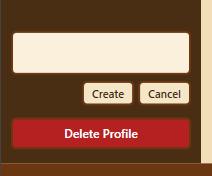
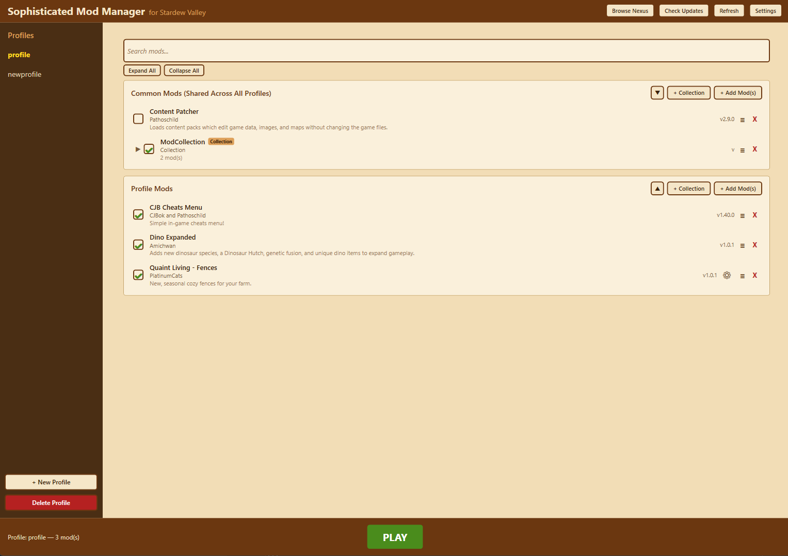
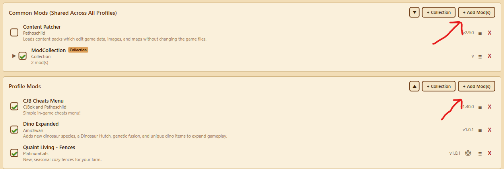
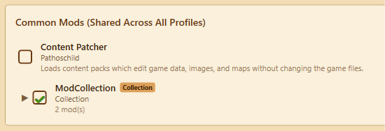
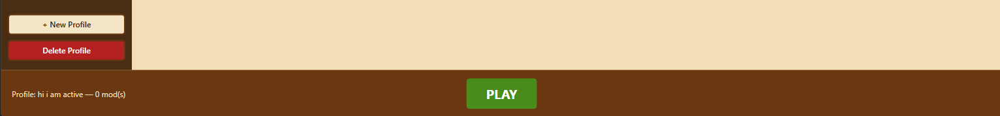

# Sophisticated Mod Manager
Mod/modpack manager for Stardew Valley
Created By: HomelessGinger for his fiancé

## Table of Contents
- [Wiki](#wiki)
- [Introduction](#introduction)
- [Installation](#installation)
- [Usage](#usage)
- [Issues](#issues)
- [License](#license)
- [Development Resources](#development-resources)

## Wiki
There is a wiki page on this repo. Click the Wiki tab at the top, or follow [this hyperlink to the wiki page](https://github.com/HomelessGinger/StardewValley_SophisticatedModManager/wiki). 

It is a WIP, especially for the first few days after the v1.0 release. It will be updated, and this line will be removed :)

The wiki has more in depth steps than this README for setting up and how to use, but this README has enough to get it going and started, so the wiki is not a requirement to figure out this software

## Introduction
Welcome to the Stardew Valley Sophisticated Mod Manager (SMM). Despite the name, it is very simple in what it does.
Core features listed here:
- **Profile-based modpacks.** Create named profiles that each have their own set of mods and saves. Switch between them with a single click.
- **Import already existing profiles** If you were previously doing the "add a . to the beginning of folder names to make modpacks" this will detect it and auto generate those profiles for you
- **Different Saves per modpack.** Hides saves if not associated with the modpack to prevent accidental corruption or opening the wrong farm
- **Mod Collections** Keep your mods as organized as you want with Collections!
- **NexusMods API integration** 
  - Check for updates and view the changelog before updating a mod
  - Browse directly in SMM, find your new favorite mod without leaving the app!
    - For premium NexusMods users (**NOT** premium for SMM, that is and always will be open source!)
      - Install and update apps directly through SMM, no need to even open Nexus Mods website
    - Unfortunately Nexus Mods does not allow direct downloads for free users, but you can upload your api key to SMM and click 'Install through Mod Manager' on Nexus Mods website!
- **Mod Configs and Version** Mod Configs and versions are specific to each profile! Edit the configs in the app! 
- **Unlimited number of modpacks.** No worries on how many mods to add, or how many packs to add. Unless we count your storage space ;)
- **Extremely Simple UI** for switching between packs. As well as only a couple buttons and a text box to add a new one.
- **Easily add in new Mods** with a click of a button.
- **Enable/disable individual mods** with a checkbox.
- **Common mods** that live outside profile folders are shared across every profile automatically.
- **One-click Play** button to launch Stardew Valley through SMAPI.
- **Configurable paths** for both the game install directory and the saves directory.
- **In-Depth Wiki** pages to make this as simple as possible for anyone regardless of experience

## Why did I make this?
TLDR: I want mod packs and these 'complicated' ways to keep multiple mods to be accessible and easily attainable for all, regardless of tech knowledge. 

I know other mod managers exist. I researched for around ten seconds before I saw the current modpack solutions (renaming folders manually). 
This is not easy to do on a touchscreen device like the one my fiancé uses. So I immediately sat down and made this! If another manager
already does what this does (auto renaming folders, hiding save files based on modpack, etc) then feel free to continue using those

I do not play Stardew, but I am a software engineer by trade. My fiancé wanted to try out random Stardew Valley challenge modpacks/mods
she saw on  Youtube, but she did not want to risk corrupting or ruining her save files she already has.
I decided to create a very simple manager, as she plays on a ROG Ally and can only use the onscreen keyboard. I saw "solutions"
online being to rename the Mods folder (or subfolders) to different things depending on which modpack you are on. Gross.
Needing to be done every time you switch and on a touchscreen keyboard? Super gross.

To solve this, I made the Sophisticated Mod Manager. All this does is allow the user to have multiple profiles 
which runs some code to change the names of the folders for you.
This also "hides" your saves that are not associated with the selected modpack. Leaving **ZERO** chance of accidentally opening
a save that should not have some game altering mod added to it (or removed from it).

## Installation

### Installing from GitHub
[GitHub Main Repo](https://github.com/HomelessGinger/StardewValley_SophisticatedModManager)
On the right-hand side of the home page there is a Releases section, downloaded the latest from there.
Sophisticated Mod Manager is version agnostic with respect to Stardew Valley and SMAPI, so downloading the latest release is always recommended!

### Installing from source
I am not sure why you would want to do it this way, but maybe you just want to learn how an app is built. Who knows!
#### Prerequisites
- [.NET 8 SDK](https://dotnet.microsoft.com/download/dotnet/8.0) installed on your machine
- [SMAPI](https://smapi.io/) installed in your Stardew Valley game directory
- Git (to clone the repository)

#### Steps
1. Clone the repository:
   ```
   git clone https://github.com/HomelessGinger/StardewValley_SophisticatedModManager.git
   ```
2. Navigate into the project directory:
   ```
   cd StardewValley_SophisticatedModManager
   ```
3. Build the project:
   ```
   dotnet build SophisticatedModManager/SophisticatedModManager.csproj -c Release
   ```
4. Run the executable from the build output:
   ```
   SophisticatedModManager\bin\Release\net8.0-windows\SophisticatedModManager.exe
   ```
   Or run directly with:
   ```
   dotnet run --project SophisticatedModManager/SophisticatedModManager.csproj
   ```

## Usage

### First Launch

When you first open the Sophisticated Mod Manager, there are a few different possible screens you may see. Please follow the on screen instructions or refer to the Wiki for help.

### Settings

Click the **Settings** button in the top-right corner. This opens the settings panel where you can configure:
- **Stardew Valley Saves Path** -- The folder where Stardew Valley keeps its save data. Default: `%appdata%\StardewValley`
- **Stardew Valley Game Path** -- The root folder where Stardew Valley is installed. Default: `C:\Program Files (x86)\Steam\steamapps\common\Stardew Valley`
- **Show mod descriptions** -- When checked, each mod in the list displays its description text underneath the author name. Enabled by default. Uncheck to keep the mod list more compact.
- **Clear Search when switching profiles** -- When checked, the mods page will clear the search bar when swapping profiles. Disabled by default.
- **Nexus Mods Integration** -- Many features of the app are only possible with a free Nexus Mods API Key from Nexus themselves. [The link to that is here](https://www.nexusmods.com/settings/api-keys)

Use the **Browse** buttons to select the correct folders, then click **Save Settings**.


*Screenshot: The settings panel showing all the fields listed above.*

### Creating a Profile

Click the **+ New Profile** button in the sidebar. Enter a name for your profile (e.g., "Vanilla Plus", "Stardew Expanded", "Multiplayer") and click **Create**.


*Screenshot: The Create New Profile dialog with a text field and Create/Cancel buttons.*

It is not the prettiest. I am a developer after all, not a designer ;))))

The first profile you create will automatically become the active profile. The profile name appears highlighted in the sidebar.


*Screenshot: The main window with one profile created, shown as active (highlighted) in the sidebar, with the content area showing the profile name and mod sections.*

### Adding Mods to a Profile

#### Adding Mods Through SMM Without API Key

To add mods to a specific profile, download the compressed file (7zip, rar, zip, etc) from Nexus Mods or elsewhere. In Sophisticated Mod Manager,
click on Add Mod in the top right of the profile/common mods box in the main content screen


*Screenshot: Zoomed in on the Profile and Common Mods section of the main content. Has a Red arrow pointed towards the top right corner, where there is an Add Mods button.*


#### Manually Adding Mods
This may feel more akin to what you have already been doing, but it is not necessary for use with this mod manager.

To add mods to a specific profile, place the mod folders inside the profile's subfolder within the Stardew Valley `Mods` directory:

```
Stardew Valley/Mods/YourProfileName/SomeMod/manifest.json
Stardew Valley/Mods/YourProfileName/AnotherMod/manifest.json
```

To add **common mods** (shared across all profiles), place them directly in the `Mods` folder (not inside any profile subfolder):

```
Stardew Valley/Mods/CommonModNameHere/manifest.json
Stardew Valley/Mods/ContentPatcher/manifest.json
```

After adding mods, click the **Refresh** button in the top-right corner to update the mod list.


*Screenshot: The main window showing a profile with several mods listed, including both common mods and profile-specific mods with checkboxes, names, authors, and versions.*

### Enabling and Disabling Mods

Each mod has a checkbox next to its name. **Check** the box to enable the mod, **uncheck** it to disable it. Disabled mods will not be loaded by SMAPI the next time you launch the game.


*Screenshot: A close-up of the mod list showing some mods checked (enabled) and some unchecked (disabled).*

### Switching Profiles

Click on any profile name in the sidebar to switch to it

The active profile is shown in **gold/yellow** text in the sidebar.


*Screenshot: The sidebar showing multiple profiles, with one highlighted as active and others in normal text.*

### Deleting a Profile

Select the profile you want to delete in the sidebar, then click the **Delete Profile** button. A confirmation dialog will appear warning you that all mods and saves for that profile will be permanently removed.

### Launching the Game

Click the large green **PLAY** button at the bottom of the window to launch Stardew Valley through SMAPI with the currently active profile's mods loaded.


*Screenshot: The bottom bar of the main window showing the status message and the large green PLAY button.*

## Issues
If you have any issues or questions about the mod, either leave a comment on the NexusMods page or leave an issue on the [GitHub Repo issues tab](https://github.com/HomelessGinger/StardewValley_SophisticatedModManager/issues).

## License
Go wild

MIT License

Copyright (c) 2026 StardewValley_SophisticatedModManager

Permission is hereby granted, free of charge, to any person obtaining a copy
of this software and associated documentation files (the "Software"), to deal
in the Software without restriction, including without limitation the rights
to use, copy, modify, merge, publish, distribute, sublicense, and/or sell
copies of the Software, and to permit persons to whom the Software is
furnished to do so, subject to the following conditions:

The above copyright notice and this permission notice shall be included in all
copies or substantial portions of the Software.

THE SOFTWARE IS PROVIDED "AS IS", WITHOUT WARRANTY OF ANY KIND, EXPRESS OR
IMPLIED, INCLUDING BUT NOT LIMITED TO THE WARRANTIES OF MERCHANTABILITY,
FITNESS FOR A PARTICULAR PURPOSE AND NONINFRINGEMENT. IN NO EVENT SHALL THE
AUTHORS OR COPYRIGHT HOLDERS BE LIABLE FOR ANY CLAIM, DAMAGES OR OTHER
LIABILITY, WHETHER IN AN ACTION OF CONTRACT, TORT OR OTHERWISE, ARISING FROM,
OUT OF OR IN CONNECTION WITH THE SOFTWARE OR THE USE OR OTHER DEALINGS IN THE
SOFTWARE.

## Development Resources
If anyone is curious, I have never made a xaml gui before. But i am very familiar with C# thanks to my day job. Anyways,
these docs helped me get started with it. Feel free to ask me any questions you may 
have if you're trying to do something similar or just wanting to learn anything code!

https://learn.microsoft.com/en-us/dotnet/desktop/wpf/get-started/walkthrough-my-first-wpf-desktop-application

https://learn.microsoft.com/en-us/dotnet/desktop/wpf/xaml/
